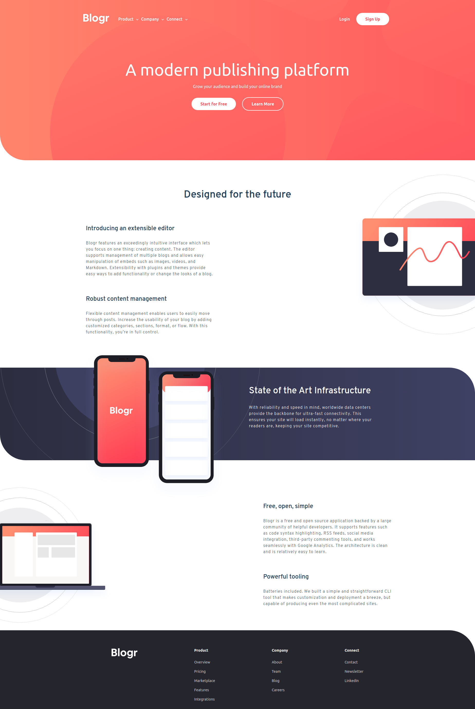
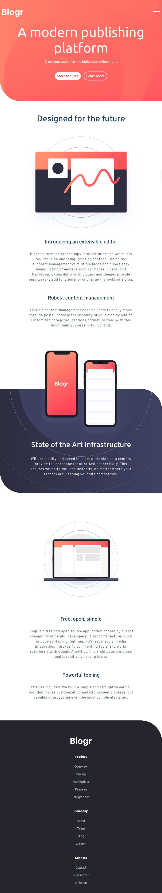

# Frontend Mentor - Blogr landing page solution

This is a solution to the [Blogr Landing Page Challenge on Frontend Mentor](https://www.frontendmentor.io/challenges/blogr-landing-page-EX2RLAApP). Frontend Mentor challenges help you improve your coding skills by building realistic projects.

## Table of contents

- [Overview](#overview)
  - [The challenge](#the-challenge)
  - [Screenshot](#screenshot)
  - [Links](#links)
- [My process](#my-process)
  - [Built with](#built-with)
- [Author](#author)

## Overview

### The challenge

Users should be able to:

- View the optimal layout for the site depending on their device's screen size
- See hover states for all interactive elements on the page

### Screenshot

### Links

- Solution URL: [Github Repo](https://github.com/rizwanmustafa/BlogrLandingPageChallenge)
- Live Site URL: [Github Page](https://rizwanmustafa.github.io/BlogrLandingPageChallenge)

## My process

### Built with

- CSS Flexbox
- SASS
- Vanilla Javascript

## Author

- Frontend Mentor - [@rizwanmustafa](https://www.frontendmentor.io/profile/rizwanmustafa)
- LinkedIn - [Rizwan Mustafa](https://www.linkedin.com/in/rizwan-mustafa-khan)
