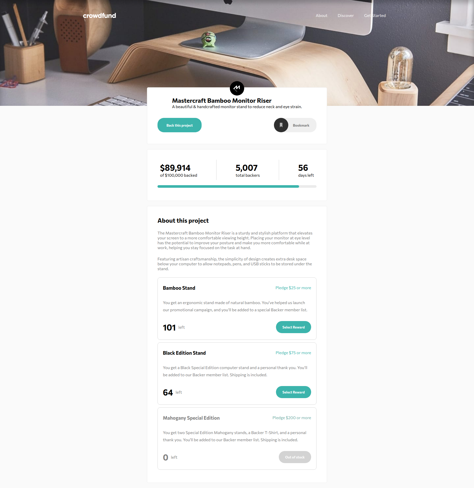
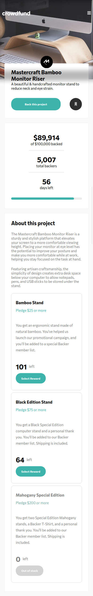

# Frontend Mentor - Crowdfunding product page solution

This is a solution to the [Crowdfunding product page challenge on Frontend Mentor](https://www.frontendmentor.io/challenges/crowdfunding-product-page-7uvcZe7ZR). Frontend Mentor challenges help you improve your coding skills by building realistic projects.

## Table of contents

- [Overview](#overview)
  - [The challenge](#the-challenge)
  - [Screenshot](#screenshot)
  - [Links](#links)
- [My process](#my-process)
  - [Technologies Used](#technologies-used)
  - [Features](#features)
  - [What I learned](#what-i-learned)
  - [Continued development](#continued-development)
  - [Useful resources](#useful-resources)
- [Author](#author)
- [Acknowledgments](#acknowledgments)

**Note: Delete this note and update the table of contents based on what sections you keep.**

## Overview

### The challenge

Users should be able to:

- View the optimal layout depending on their device's screen size
- See hover states for interactive elements
- Make a selection of which pledge to make
- See an updated progress bar and total money raised based on their pledge total after confirming a pledge
- See the number of total backers increment by one after confirming a pledge
- Toggle whether or not the product is bookmarked

### Screenshot

Desktop Screenshot

Mobile Screenshot

### Links

- Solution URL: [Github Repo](https://github.com/rizwanmustafa/CrowdfundingProductPageChallenge)
- Live Site URL: [Github Pages](https://rizwanmustafa.github.io/CrowdfundingProductPageChallenge)

## My process

### Technologies Used

- HTML 5
- CSS 3
- SASS
- React

### Features

- Semantic HTML5 Markup Used
- Styled using Flexbox
- Powered by React
- Fully Responsive

### What I learned

This was my first time using React after learning it. Although I was overwhelmed at first, things slowly began to make sense.

It was a great learning experience overall.

### Continued development

I need to look into SVG Animations

## Author

- Frontend Mentor - [@rizwanmustafa](https://www.frontendmentor.io/profile/rizwanmustafa)
- LinkedIn - [Rizwan Mustafa](https://www.linkedin.com/in/rizwan-mustafa-khan)

## Acknowledgments

I would like to thank anyone who leaves their valuable suggestions on my solutions. A special thanks to tediko, palgramming, and ApplePieGiraffe for helping me along this wonderful journey!
