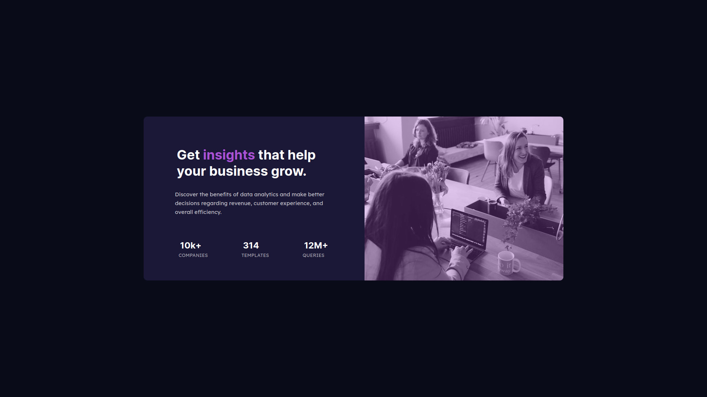

# Frontend Mentor - Stats preview card component solution

This is a solution to the [Stats preview card component challenge on Frontend Mentor](https://www.frontendmentor.io/challenges/stats-preview-card-component-8JqbgoU62). Frontend Mentor challenges help you improve your coding skills by building realistic projects.

## Table of contents

- [Overview](#overview)
  - [The challenge](#the-challenge)
  - [Screenshot](#screenshot)
  - [Links](#links)
- [My process](#my-process)
  - [Built with](#built-with)
  - [Continued development](#continued-development)
- [Author](#author)

## Overview

### The challenge

Users should be able to:

- View the optimal layout depending on their device's screen size

### Screenshot

### Links

- Solution URL: [Github Repo](https://github.com/rizwanmustafa/StatsPreviewCardChallenge)
- Live Site URL: [Github Live Page](https://rizwanmustafa.github.io/StatsPreviewCardChallenge/)

## My process

Firstly I designed the desktop layout using CSS flexbox. Then I tweaked the website to be responsive even for a mobile device

### Built with

- Semantic HTML5 markup
- CSS custom properties
- Flexbox

### Continued development

I am going to focus more on website responsiveness as I seem to be lacking behind in that

## Author

- Linkedin - [Rizwan Mustafa](https://www.linkedin.com/in/rizwan-mustafa-1897301b3/)
- Frontend Mentor - [@rizwanmustafa](https://www.frontendmentor.io/profile/rizwanmustafa)
