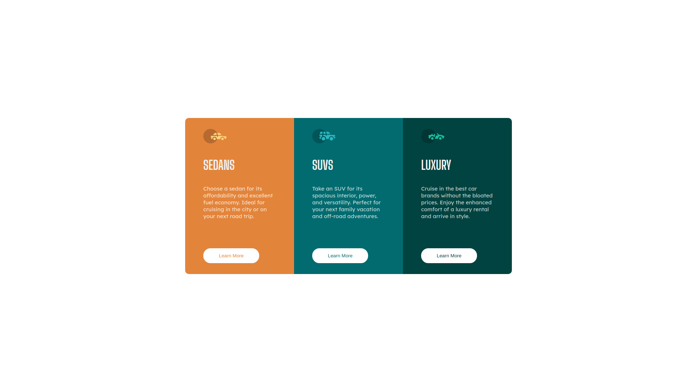

# Frontend Mentor - 3-column preview card component solution

This is a solution to the [3-column preview card component challenge on Frontend Mentor](https://www.frontendmentor.io/challenges/3column-preview-card-component-pH92eAR2-). Frontend Mentor challenges help you improve your coding skills by building realistic projects.

## Table of contents

- [Overview](#overview)
  - [The challenge](#the-challenge)
  - [Screenshot](#screenshot)
  - [Links](#links)
- [My process](#my-process)
  - [Built with](#built-with)
  - [Continued development](#continued-development)
- [Author](#author)

**Note: Delete this note and update the table of contents based on what sections you keep.**

## Overview

### The challenge

Users should be able to:

- View the optimal layout depending on their device's screen size
- See hover states for interactive elements

### Screenshot

### Links

- Solution URL: [Github Repo](https://github.com/rizwanmustafa/ThreeColumnPreviewCardChallenge)
- Live Site URL: [Github Page](https://rizwanmustafa.github.io/ThreeColumnPreviewCardChallenge/)

## My process

First of all I saw the design and Flexbox for solving this problem. While looking at the design, I saw where flexbox was required and marked it. Then I created the basic layout and design for desktop for the webpage. Then I added paddings and other minor things needed to achieve the look. Lastly, I tweaked the design to fit the mobile design

### Built with

- Semantic HTML5 markup
- Flexbox

### Continued development

I would like to learn how to use CSS custom properties.

## Author

- Frontend Mentor - [@rizwanmustafa](https://www.frontendmentor.io/profile/rizwanmustafa)
- Linkedin - [Rizwan Mustafa](https://www.linkedin.com/in/rizwan-mustafa-1897301b3/)
